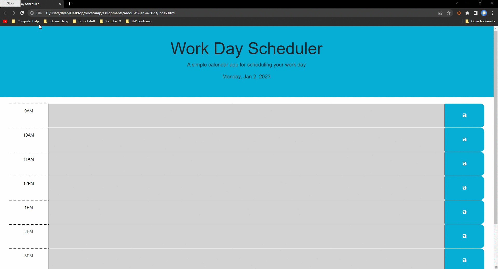

# Work Day Scheduler
A simple user friendly calendar that allows the user to enter events for each hour of their business day and save calendar events to remain there each day until changed.

## module5-jan-4-2023

* Deployed:
* GitHub: https://github.com/Ryebread5555/module5-jan-4-2023

## Acceptance Criteria
```
- GIVEN I am using a daily planner to create a schedule
- WHEN I open the planner
- THEN the current day is displayed at the top of the calendar
- WHEN I scroll down
- THEN I am presented with time blocks for standard business hours
- WHEN I view the time blocks for that day
- THEN each time block is color-coded to indicate whether it is in the past, present, or future
- WHEN I click into a time block
- THEN I can enter an event
- WHEN I click the save button for that time block
- THEN the text for that event is saved in local storage
- WHEN I refresh the page
- THEN the saved events persist
```

## Function
- Workday Scheduler displays the current day and date on the top of the page.
- 9AM-5PM workday hours are displayed on the page.
- Time blocks are color cordinated by past(gray), present(red), and future(green).
- Time blocks allow you to input information and save to store their schedule even when refreshed.
- Information is stored to users local storage.

## Languages
- HTML
- CSS
- Bootstrap
- JQuery
- DayJs

## Mock-Up
